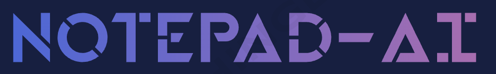
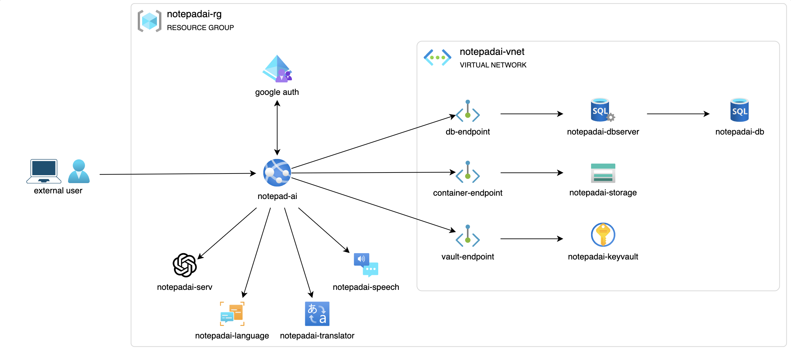

    

# Notepad-AI
> Notepad-AI is a cloud based project developed for the master degree course of Cloud Computing at [University of Salerno](https://www.unisa.it/).

## Mission
Notepad-AI is an online note-taking cloud platform, entirely based on [Microsoft Azure](https://azure.microsoft.com) infrastructure.  Here each user has the opportunity to register and, right away, be able to create their own notes, either classic format either using markdown and html syntax. In addition some IA-based services such as text-summarisation, text-translation and text-generation are provided, with the purpose of enhancing the user experience and offering a full suite of utilities commonly used while studying or researching. Finally, you can also export your notes and save them locally.

## Features
1. Registration, login and deletion of your account.
2. Classic and Markdown notebooks creation, opening and deletion.
3. Extraction of saved notebooks in PDF file format.
4. Abstractive text-summarisation, text-translation, text-generation and speech-to-text conversion (experimental).

## System Architecture and Services

1. **Azure App-Service**, used for the deploying of the flask web-app.
2. **Azure SQL Database**, relational database used for the storing of users and notebooks informations.
3. **Azure Storage Account**, used for the creation of a container that stores all the notebooks of the platform.
4. **Azure Key-Vault**, secure archive used for the storing of secrets like api-keys, private admin credentials and access endpoints.
5. **Azure Virtual Network**, service used for the creation of a private virtual network in order to secure critical services like database, container and key-vault and making them unaccessible from public sources.
6. **Azure OpenAI**, service used for the creation of a generative-model used for QnA.
7. **Azure AI Language**, used for the abstractive text-summarisation utility.
8. **Azure AI Translator**, used for the creation of the in-app text-translator.
9. **Azure AI Speech**, used for the experimental speech-to-text conversion utility.

## Repository Structure
- **scripts**, folder containing all the python scripts used for database, container and AI-services operations.
- **staticFiles**, folder containing all the static files, css and js,  needed by the Flask Web-Application.
- **templateFiles**, folder containing all the HTML pages.
- **main directory**, containing the app configurations, readme, license and startup application script.

## Website Usage
Since this web-app is intended to be public and open-source, you can reach it by clicking [Notepad-AI](https://notepad-ai.azurewebsites.net).
